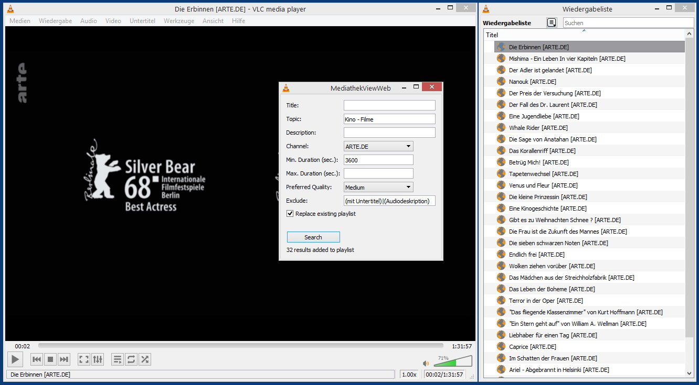
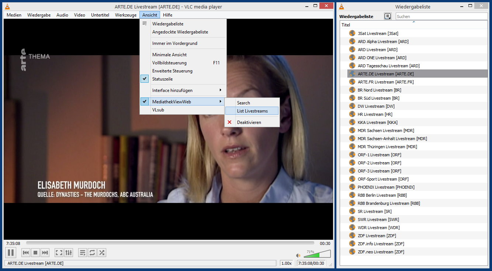

# MediathekViewWebVLC
MediathekViewWeb Lua extension for VLC

**Requirements**

VLC 3.x

**Installation**

To install, place file "mediathekviewweb.lua" in the following directory, depending on your operating system:

a) Install for current user only

Windows: %APPDATA%\vlc\lua\extensions\
Linux:   ~/.local/share/vlc/lua/extensions/
macOS:   /Users/<your_name>/Library/Application Support/org.videolan.vlc/lua/extensions/

b) Install for all users

Windows: %ProgramFiles%\VideoLAN\VLC\lua\extensions\
Linux:   /usr/lib/vlc/lua/extensions/
macOS:   /Applications/VLC.app/Contents/MacOS/share/lua/extensions/

**Screenshots**

* MediathekViewWebVLC Search in VLC 3.0.12/Win 8.1:

  

* MediathekViewWebVLC listing Livestreams in VLC 3.0.12/Win 8.1:

  
